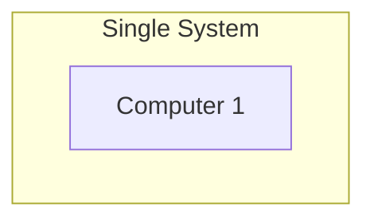
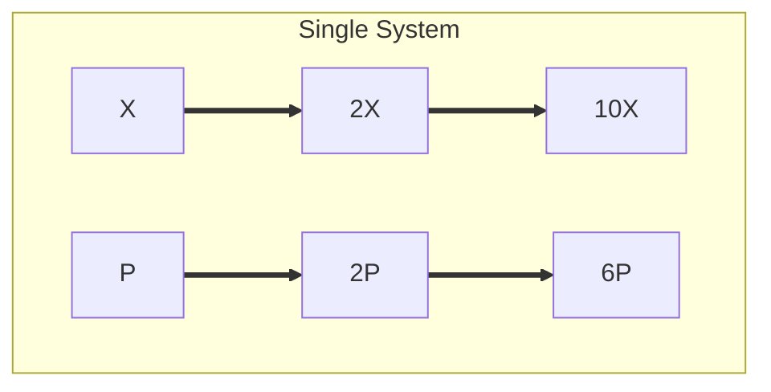
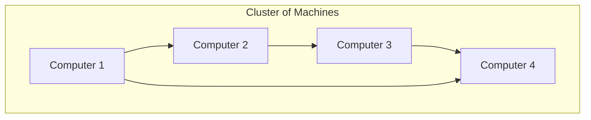
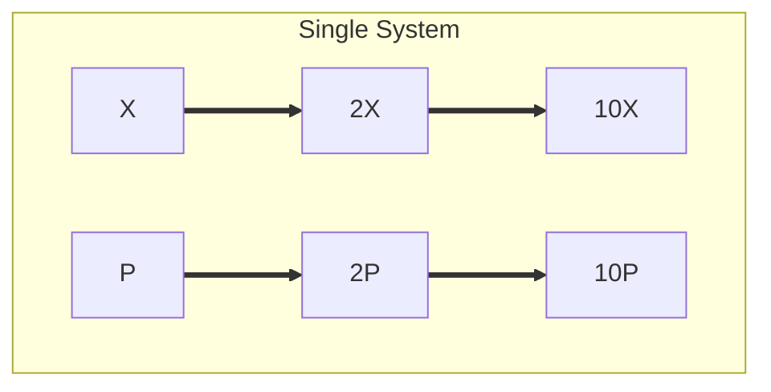

# **Big Data Overview**

Refers to large, complex sets of data that are difficult to manage, process and analyze using traditional data management tools. These datasets are often too vast or to varied to be handled by conventional database systems or processing tools.

Big data typically involves the following key characteristics often referred to as the 3V's and sometimes expanded to include more:

1. **Volume** : This refers to the sheer amount of data being generated. As devices, sensors and users generated data (such as from social media, IoT devices and online transactions), the volume grows exponentially.
   
   Note : There is no set amount/volume when the problem becomes a big data

2. **Velocity** : This is the speed at which data is generated processed and analyzed. The processing and analyzing data at the speed it generated can be considered this way:
	- In some case, the data is generated in real-time requires System that can keep up with the rapid flow 
		 Examples : Streaming data from sensors, financial transactions, Live feed, Fraud detection, and etc
	-  In some case, the data is continuously generated but taking 1, 2 or n mins to process, this is called near-real time processing
		 Example : Amazon to confirm the order placed
	-  In some case, the data is processed in Batches
		 Example : Credit card billing

3. **Variety** : Big data comes in many forms. It can be structured (like tables in a dataset), semi-structured (such as JSON, XML), and unstructured (like text, images, videos or social media posts).
   This variety makes it challenging to integrate, analyze and interpret the data.

4. **Veracity** : The uncertainty or quality of data. Given the vastness and variety of data  sources it is often important to ensure that data is reliable and accurate for decision-making. example negative age data (age < 0)

5. **Value** : The usefulness of data. It's not just having large amount of data, it's about extracting meaning full insights from it

Note : For a problem to be a big data problem not all V's need to  be satisfied generally a consideration of 2 or 3V's are enough.

---
## **Distributed System**

##### **What is Distributed System?**
A distributed system is a collection of machines or nodes that are connected and work together to share resources and co-ordinate activities.

##### **Why do we need distributed system?**
To handle massive amounts of data and workloads on several machines. Because big data requires a distributed system to handle massive amounts of data. A single computer can manage data up to a certain limit, such as storage, memory, and processor.  
Example: Consider a retail store; initially, the sales registry will be smaller, but as sales expand, so will the sales registry, resulting in a storage restriction, and as storage grows, so will the processing issue, which takes longer to process the data. Simply adding more memory and storage to the system/application will not address the large data issue.

#### **Single system or Monolithic System:**

A single system typically refers to a standalone machine or a server that handles the entire processing, storage and analysis of big data while not commonly associated with truly massive datasets (which often required distributed system), single system setup might still be used in specific cases or small scale data applications.

##### **Characteristics**

1. **Monolithic setup**: A single unified system (server or cluster) handles all take
2. **Limited Scalability** : Scaling is restricted to the capability of a single machine (ex: adding more RAM, CPU or Storage)
3. **Lower Complexity** : Less overhead for managing multiple nodes or servers
4. **Single Point of Failure** : If the system fails, the entire infrastructure may go down

##### **Use Cases**

1. Suitable for small to medium sized datasets
2. Research or testing environments where complex infrastructure isn't necessary 

As previously said, its performance can be multiplied by 2x, 3x,... 6x. However, because it is a single system or self-contained unit, it will have scalability, cost, and performance issues; to overcome this, we need a distributed system.

This process is considered as Vertical Scaling

#### **Multiple System or Distributed System**

In contrast, multiple systems in Big Data refers to architecture where data and processing tasks are distributed across many machines (nodes to handle large-scale data processing and analysis).

This is the typical approach for big data workloads, especially when the volume of data exceeds what a single machine can handle. This kind of architecture can be found in **distributed systems** like **Hadoop**, **Spark**, and other big data frameworks.

##### **Characteristics**

1. **Distributed Architecture** : Data is split across multiple machines with each node responsible
2. **Scalable** : Adding more nodes to the systems allows to scale horizontally, accommodating growing datasets
3. **Fault Tolerance** : If one node or machine fails the system can recover, ensuring data integrity and reliability
4. **Parallel Processing** : Tasks are divided and executed in parallel across multiple nodes significantly  improving speed

##### **Use Cases**

1. Suitable for application high scalability, fault tolerance and processing power (e.g. Social media analytics, large scale e-commerce, scientific research and IoT data analysis) 
2. Critical for organisation with massive datasets such as large tech companies, financial institutes and telecom operators 

In here, nodes or machines are connected in LAN where they will communicate with each other and will distribute the workload and process the data. Because of this performance will increase and there is no scalability issue and considered as **True Scaling**.

This process is considered as Horizontal Scaling, where if we need more computing power we can add more machine/computer to the network or vice versa

All the good big data systems are based on **Distributed Architecture**.

---

### **Designing a Good Big Data System**  

Designing a good data system involves careful planning, selection of appropriate technologies, and addressing several key challenges such as scalability, performance, data integrity, and security.

#### 1. Scalability

In the context of designing a big data system, scalability refers to the system's ability to handle increasing amounts of tasks efficiently as data, users, and computational demands grow. It is a key requirement for big data systems, as they often need to accommodate rapid growth in data volume, velocity, and variety. Scalability ensures that the system can expand and adapt to these growing demands.

##### Types of Scalability:

1. **Horizontal Scalability (Scale-out)** :  
    This refers to adding more machines (nodes) to the system to distribute the load and handle larger datasets.  
    **Advantages**:
    
    - Lower cost per unit of scaling.
    - More flexibility in expanding services.
    - Potentially easier to implement as it leverages distributed systems.  
        **Example**: Adding more nodes to a Hadoop cluster as the data size grows.
2. **Vertical Scalability (Scale-up)**:  
    This involves upgrading the existing hardware (increasing CPU, RAM, storage) in a  single machine/server.  
    **Advantages**:
    
    - May be simpler to manage in the short term because it doesn't require the complexity of distributed systems.
    - Useful for workflows that require high single-node performance.
    
    **Disadvantages of Vertical Scalability (Scale-up):**

	 - Hardware upgrades can become expensive, and there's a limit to how much a single machine can be upgraded.
     - Less fault-tolerant compared to horizontally scaled systems that use distributed architecture.

**Example**: Upgrading the system storage and memory of a single database server to handle growing demands.

---

#### 2. Fault Tolerance and Reliability

Scalable systems need to be designed to handle node failures gracefully. Data replication and recovery mechanisms (such as in HDFS or cloud storage services) are critical to ensure optimal performance.

**Reliability**:  
Reliability refers to the ability of a system to consistently perform its intended function without failure over time.  
In the context of big data systems, reliability means the system can handle the expected workloads and data processing tasks consistently without pauses, and it can recover from temporary disruptions in a way that minimises impact.

**Fault Tolerance**:  
Fault tolerance refers to the ability of a system to continue operating correctly in the presence of software or hardware failures.  
**Key Requirements**:

- The system can detect and handle failures gracefully without leading to system-wide outages or data loss.

**Cost-Effectiveness**:  
In the context of scalability, cost-effectiveness refers to the ability to design big data systems that deliver performance and functionality while maintaining control over costs related to infrastructure, storage, computing power, and ongoing maintenance.

In big data systems, the main challenge is to balance the need for scalability, security, reliability, and performance with the economic constraints of the organisation or project.

---

#### 4. Security and Data Privacy:

Security and data privacy are fundamental concerns in designing big data systems, especially as the sensitivity and complexity of data grow alongside its volume.

Both concepts are related but distinct, and ensuring robust protection of both can help prevent:

- Data breaches
- Regulatory violations
- Loss of trust

---
## **On-premises V/S Cloud**

| Aspect           | On-Premise                                                                 | Cloud                                                                                     |
|------------------|----------------------------------------------------------------------------|------------------------------------------------------------------------------------------|
| Deployment       | Hardware and software are hosted within the organization’s facilities.    | Resources and services are hosted on the provider’s servers and accessed via the internet. |
| Cost Model       | High upfront costs for hardware, maintenance, and IT staff (CAPEX).       | Pay-as-you-go pricing, with minimal upfront costs (OPEX).                                |
| Scalability      | Limited by the organization’s hardware capacity; scaling requires purchasing and installing new equipment. | Highly scalable—add resources on demand instantly.                                       |
| Maintenance      | The organization is responsible for managing and maintaining hardware, software, and updates. | Managed by the cloud provider (e.g., AWS, Azure, GCP).                                   |
| Flexibility      | Fixed capacity with little room for dynamic needs.                        | Highly flexible, allowing resources to scale up or down.                                 |
| Security         | Data remains within the organization’s premises, offering greater control. | Security is managed by the provider; often meets global compliance standards but might raise concerns for sensitive data. |
| Disaster Recovery| Requires internal backups and disaster recovery systems.                  | Cloud providers offer built-in disaster recovery and redundancy.                         |

---

## **Database V/S Data Warehouse V/S Data Lake**

| Feature         | Database                                | Data Warehouse                              | Data Lake                                             |
|-----------------|----------------------------------------|--------------------------------------------|-------------------------------------------------------|
| Purpose         | Real-time transactions                | Historical data analysis                    | Raw data storage for diverse use cases               |
| Data Structure  | Structured                            | Structured                                  | Structured, Semi-structured, Unstructured            |
| Speed           | High-speed for small queries          | Optimized for analytical queries            | Variable (depends on data processing)                |
| Use Case        | Operational systems (e.g., POS)       | Business intelligence                       | Advanced analytics, machine learning                 |
| Scalability     | Limited                               | Moderate                                   | Highly scalable                                       |

---

## **OLTP V/S OLAP**

| Aspect               | OLTP                                                  | OLAP                                                                       |
| -------------------- | ----------------------------------------------------- | -------------------------------------------------------------------------- |
| **Purpose**          | Handles day-to-day transactional data.                | Handles historical data for analytical queries.                            |
| **Data**             | Real-time, current operational data.                  | Historical, aggregated, or summarized data.                                |
| **Operations**       | Frequent INSERT, UPDATE, DELETE operations.           | Primarily SELECT queries for analysis.                                     |
| **Query Complexity** | Simple, fast queries (e.g., fetching single records). | Complex queries with joins, aggregations, and filters.                     |
| **Schema Design**    | Normalized schema (e.g., 3NF) to minimize redundancy. | De-normalized schema (e.g., star or snowflake schema) for faster querying. |
| **Transaction Type** | Short, atomic transactions (e.g., order placement).   | Long, batch-oriented queries (e.g., sales trends analysis).                |
| **Users**            | Operational staff, front-end applications.            | Data analysts, decision-makers.                                            |
| **Data Volume**      | Smaller data sets, as it handles current operations.  | Very large data sets (terabytes to petabytes).                             |
| **Performance**      | Optimized for fast write operations.                  | Optimized for read-intensive operations.                                   |
| **Examples**         | Banking systems, e-commerce sites, CRMs.              | Data warehouses, BI tools, analytical dashboards.                          |
| **Tools/Databases**  | MySQL, PostgreSQL, MongoDB, Oracle (OLTP mode).       | Snowflake, Amazon Redshift, Google BigQuery.                               |

---

## **Data Engineer V/S Big Data Engineer**

| Aspect       | Data Engineer                                         | Big Data Engineer                                              |
|--------------|-------------------------------------------------------|----------------------------------------------------------------|
| Focus        | Handles structured and manageable data.              | Handles massive datasets (Big Data).                          |
| Tools        | SQL, Python, Airflow, ETL tools.                     | Hadoop, Spark, Hive, Kafka, NoSQL databases.                  |
| Scalability  | Works with traditional systems.                      | Works with distributed systems for scalability.               |
| Storage      | Data warehouses and databases.                       | Data lakes and distributed storage systems.                   |
| Processing   | ETL pipelines for structured data.                   | Parallel processing for large-scale data.                     |
| Use Case     | Preparing data for a monthly sales report.           | Analyzing social media trends in real-time.                   |

---
## **ETL vs ELT**

| **Aspect**             | **ETL (Extract, Transform, Load)**             | **ELT (Extract, Load, Transform)**                |
|-------------------------|-----------------------------------------------|--------------------------------------------------|
| **Processing Location** | Data is transformed before loading.           | Data is transformed after loading.               |
| **Target System**       | Traditional data warehouses with limited compute power. | Modern data lakes or cloud platforms with high compute power. |
| **Data Type**           | Structured data.                              | Structured, semi-structured, unstructured data.  |
| **Speed**               | Slower, as transformations occur beforehand.  | Faster, as transformations happen after loading. |
| **Use Case**            | Bank transactions (cleaned before storage).   | Social media analysis (raw data stored for future use). |
