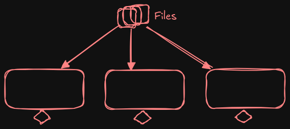
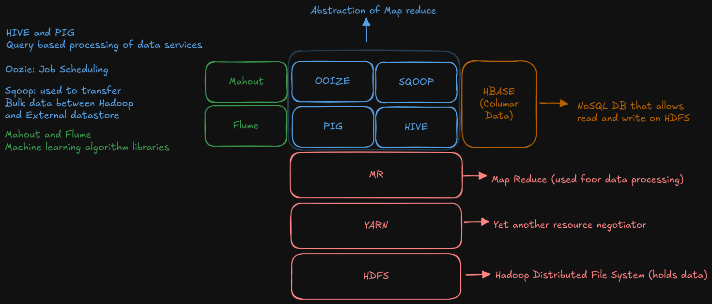
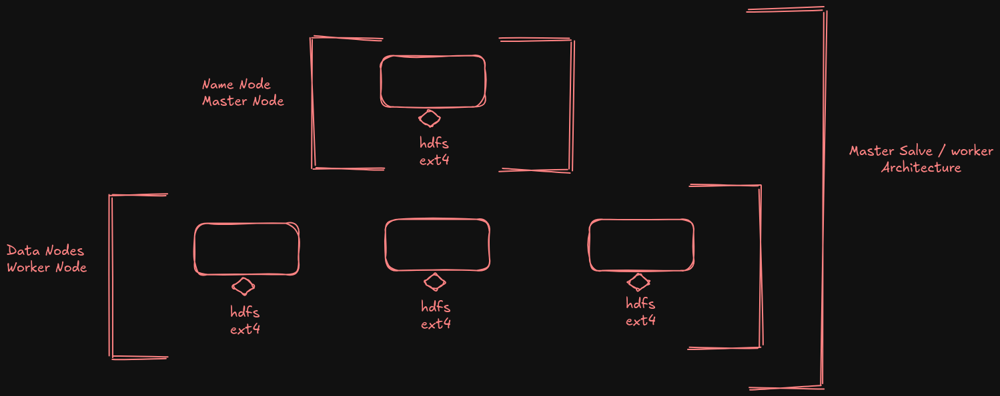
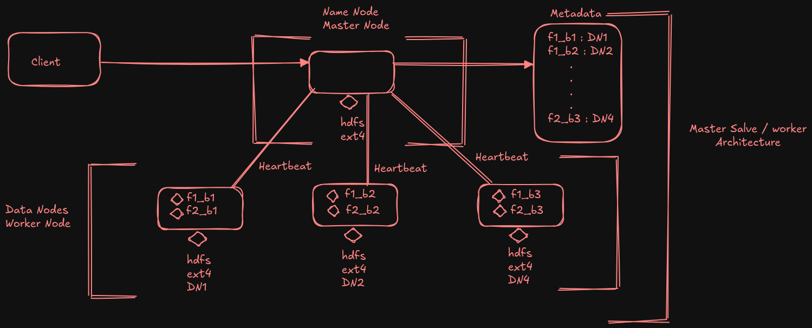
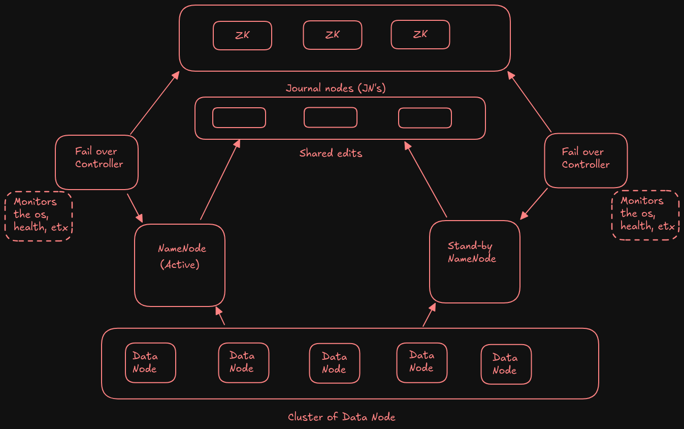

# **Hadoop**
### **Problem Before Hadoop:**

1. **Storage Limits**
2. **Processing Issues**
3. **Expensive to Add More Memory**

For example, refer to this: /Big-Data-With-Azure-And-AWS-Cloud-Mastery-Program/01-BigDataFundamentals/Big_Data_Overview.md

---

### **Solutions Proposed by Google:**

To solve the problems mentioned above, **Google** developed two key technologies:

1. **Google File System (GFS)**

    - A **distributed file system** designed to handle massive datasets across clusters of machines.
3. **Google MapReduce**

    - A **programming model** for processing large datasets on clusters by splitting tasks into **Map** and **Reduce**, allowing for parallel processing and fault tolerance.

---

### **Inspiration for Apache Hadoop:**

- **Apache Hadoop** was inspired by **Google File System (GFS)** and **Google MapReduce**.

- **Apache Hadoop** is an open-source framework designed for **distributed storage** and **processing** of large datasets using clusters of commodity hardware. It enables storing and processing data across many inexpensive machines working together.    

---

### **Core Tasks of Hadoop:**

1. **Massive Data Storage**
2. **Faster Parallel Processing**

---

### **Properties of Hadoop:**

1. **Scalability**

    - Hadoop can handle, store, and distribute large amounts of data across many servers.
2. **Fault Tolerance**

    - Hadoop is fault-tolerant, meaning it can continue to function and perform its tasks even in the event of hardware failure.
3. **Distributed Processing**

    - Hadoop allows big data analytics jobs to be split into smaller tasks and processed across multiple machines in parallel.
4. **Cost-effectiveness**

    - Hadoop is a cost-effective framework for managing big data because it relies on low-cost hardware and open-source software.

### Key Points to Discuss Before Diving into the Hadoop Ecosystem

---

**1. What is a File System?**

A **file system** is a method that an operating system uses to store and manage data on storage devices.

**Examples:**

- **Windows**: NTFS or FAT32
- **Apple**: APFS
- **Linux**: ext or ext4

In other words, a **file system** acts as a layer between the hardware and the operating system, helping store and manage files.

**2. What is a Block?**

A **block** is the smallest unit of data storage in a file system.

**Example:** If we want to create a 10KB file in NTFS/APFS/ext4, the file would be divided into smaller chunks (blocks). For example, the 10KB file could be split into three blocks in a file system.

**Why Blocks?**

- **Faster data reading and writing**
- **Simplifies file management**
- **Optimizes storage**

**Block Size Depends on the File System:**

- **Windows (NTFS)**: 4KB
- **Hadoop/HDFS**: 128MB

**3. Types of File Systems**

- **Standalone File System**: In this type, data files are stored in a **single system**. There is no distribution of data, and everything is managed on one machine.
   
   

   - **Distributed File System**: In this type, data or files are **spread** or **distributed** across **multiple systems**. This approach allows for handling large amounts of data by utilizing the resources of several machines working together, rather than relying on a single machine.
   
   

 **4. Cluster and Node** 

- **Cluster**: A **cluster** is a group of machines working together to perform a task or set of tasks, often in parallel.

    - **Example**: An **HDFS cluster** can consist of 10 machines (or nodes) working together.

- **Node**: A **node** refers to an individual machine within a cluster. Each node performs a part of the work, and collectively, they form the entire cluster.    

**5. Process and Daemon Process**

- **Process**: A **process** is a program that is actively running in the system.

- **Daemon Process**: A **daemon process** is a special type of process that runs continuously in the background and performs system-level tasks without direct user interaction.

    - In **Hadoop**, a process is a Java program that runs on the system, while a **daemon process** runs in the background to handle various system services.
    - **Note**: Daemon processes are not directly controlled by the user.

 **6. Metadata**

- **Metadata** refers to **data that describes other data**, or information that provides context or details about the data.
    - **Example**: For an image file, the actual image is the data, while attributes like **size**, **creation date**, and **pixel dimensions** are the **metadata**.

**7. Replications**

- **Replications** involve the process of **storing identical copies** of data across multiple systems. This is a **fault tolerance** mechanism to ensure data availability even in the case of hardware failure.
    - In other words, replication means making multiple copies of the same data to safeguard against data loss.

---
## **Hadoop ecosystem**:

From the diagram we can consider that:
1. Loosely coupled Framework
2. Integration

### **HDFS (Hadoop Distributed file system)** 

Hadoop Distributed File System (HDFS) is a file system that manages large data sets that can run on commodity hardware. HDFS is the most popular data storage system for Hadoop and can be used to scale a single Apache Hadoop cluster to hundreds and even thousands of nodes.

It provides effective access to data for Big Data use cases, replicates the data for fault tolerance, and distributes the data across several nodes.

#### **Architecture**

#### **Analogy: HDFS NameNode and DataNode**

**Library Setup:**

- **Librarian** = **NameNode**
- **Shelves** = **DataNodes**
- **Students (clients)** = **Users/Applications**

**How it Works:**

- **Librarian (NameNode)**: The librarian keeps track of where each book is stored, but doesn't actually store the books. Similarly, the **NameNode** in HDFS manages metadata and knows where the data blocks are located, but doesn't store the actual data.
    
- **Shelves (DataNodes)**: The shelves are where the books are physically stored. In HDFS, the **DataNodes** are the physical locations where data blocks are stored.
    
- **Students (Clients)**: When a student wants to read a book, they ask the librarian, who tells them which shelf the book is on. In HDFS, when a client wants to read or write a file, they ask the **NameNode**, which directs them to the appropriate **DataNode(s)** where the file blocks are stored.

---
#### **Temporary Failure in DataNodes**

**Types of Temporary Failures:**

1. **Network Outage**
2. **Software Issue**
3. **Reboot for Maintenance** (e.g., Security Patch, OS Upgrade)

---

#### **Process During Temporary Failure**

1. **Detection / Heartbeat Detection**

    - If a **DataNode** doesn't send a heartbeat within a specified time, it is considered to have a **Temporary Failure**.
        - The default heartbeat interval is **3 seconds**, but this can be modified.

2. **Replication**

    - The **NameNode** identifies blocks stored on the unavailable **DataNode** and marks them as **under-replicated**.
    - The **NameNode** then starts a process to **replicate the data blocks** to available and healthy **DataNodes**.
    - The **NameNode** also updates the metadata to reflect the new replication status.

3. **Recovery Process**

    - Once the **DataNode** recovers from the temporary failure and sends a **Block Report** to the **NameNode**, the following steps occur:
        1. If extra replicas were created during the failure, these replicas are **deleted**.
        2. The **NameNode** ensures consistency by **dynamically updating** the metadata to reflect the changes

---

#### **Permanent Failure in DataNodes**

**Types of Permanent Failures:**

- **Hardware Failure** (e.g., Motherboard Failure)
- **Disk Corruption** (e.g., Hardware/Memory Failure)
- **Decommissioning the Node** (Removing the node or scaling down the cluster)

---

#### **Process During Permanent Failure**

1. **Detection / Heartbeat Detection**

    - If a **DataNode** doesn't send a heartbeat for a time **longer than the specified interval**, the **NameNode** will declare the DataNode as **dead** due to missing heartbeats.
        - For example, if the NameNode doesn't receive a heartbeat from a node for **more than ten minutes**, it will consider the DataNode dead.

2. **Replication**

    - If the **DataNode** is corrupted, has a hardware failure, or is decommissioned, the **NameNode** will re-replicate the blocks stored on that node to a new **healthy DataNode**.
    - The **NameNode** updates the metadata to point to the new copies and removes the reference to the previously failed DataNode.

3. **Returning Failed DataNode**

    - If a previously failed **DataNode** comes back online, it is not trusted automatically. The blocks from the returning DataNode are **ignored** and eventually **cleaned up**.

---

#### **Few Takeaways:**

1. **HDFS Handles Failure Gracefully**: HDFS is designed to handle both temporary and permanent failures without data loss.
2. **Metadata is the Backbone of HDFS**: Metadata plays a crucial role in managing data and replication.
3. **Replication Factor is Strictly Maintained**: HDFS ensures that the replication factor is consistently upheld to prevent data loss.

---

### **NameNode Failure**

- **SPOF (Single Point of Failure)**: The **NameNode** is the most critical component of HDFS. If the **NameNode** fails, you can lose access to all data since the **NameNode** holds the metadata (information about the file system structure, data blocks, and DataNodes, etc.).

---

### **Secondary NameNode**

- The **Secondary NameNode** is a helper node that assists the primary **NameNode** by **check-pointing** its state, specifically the **fsimage** file.

---

### **What is fsimage?**

- **fsimage** is a **File System Image** that stores the complete state of the Hadoop Distributed File System (HDFS) at a given point in time.
    
- **What does it contain?**
    
    - It contains information about:
        - **Directory structure**
        - **Metadata** (information about files, their locations, and DataNodes storing the blocks)

---

### **How it Works:**

1. The **NameNode** uses the **fsimage** file when it starts up to know the complete structure of the file system.
2. The **NameNode** also maintains a copy of the **fsimage** on disk.
3. As changes are made (e.g., files are created, deleted, or modified), these changes are logged in the **edit logs**.
4. Periodically, the **NameNode** applies changes from the **edit logs** to the **fsimage** file in a process called **check-pointing**.

---

#### **When the NameNode Fails**

- **Secondary NameNode**: When the primary **NameNode** fails, the **Secondary NameNode** will have the **fsimage** and the **edit logs** up until the point of failure. However, the **Secondary NameNode** does not act as a **fail-over mechanism** — it cannot take the role of the **NameNode** automatically.
    
- **Post-Failure Recovery**: After the **NameNode** failure, the **fsimage** from the **Secondary NameNode** can be used to bring up a new **NameNode** on a new, healthy machine or node.
    
    - **Note**: This process is not a high-availability solution. There will be some **downtime** while the new **NameNode** is set up and the data is synchronized using the **fsimage** and **edit logs**.

---

#### **Standby NameNode (Hadoop 2.2 and above)**

- The **Standby NameNode** feature was introduced in **Hadoop 2.2** and is considered a **high-availability** architecture.

- **Functionality**: The **Standby NameNode** acts as a **hot backup** for the **Active NameNode**. It takes over the role of the **Active NameNode** as soon as the **Active NameNode** goes down or fails. This ensures that there is no downtime.

- **Key Features**:

    - **Hot Backup**: The **Standby NameNode** is always ready to take over if the **Active NameNode** fails.
    - **Constant Connection**: The **Standby NameNode** maintains a constant connection with the **Active NameNode** to stay in sync.
    - **Namespace Copy**: The **Standby NameNode** keeps a copy of the namespace image in memory, ensuring it has the latest state of the file system.

#### **Features of Standby NameNode (Hadoop 2.2 and Above)**

1. **High Availability**

    - The **Standby NameNode** maintains a **synchronized copy of the metadata** in memory, ensuring that the data is always up-to-date and ready for fail-over if needed.

2. **Synchronization via Shared Edits**

    - Synchronization between the **Active NameNode** and the **Standby NameNode** happens through **shared edits**. Both nodes have access to a **shared directory of journals**, which ensures that the **Standby NameNode** stays in sync with the **Active NameNode**'s changes in real time.

3. **Fail-over Mechanism**

    - In the event of a failure of the **Active NameNode**, the **Standby NameNode** can take over its role with minimal downtime, ensuring **continuity of service** and **reducing the risk of data loss**.

