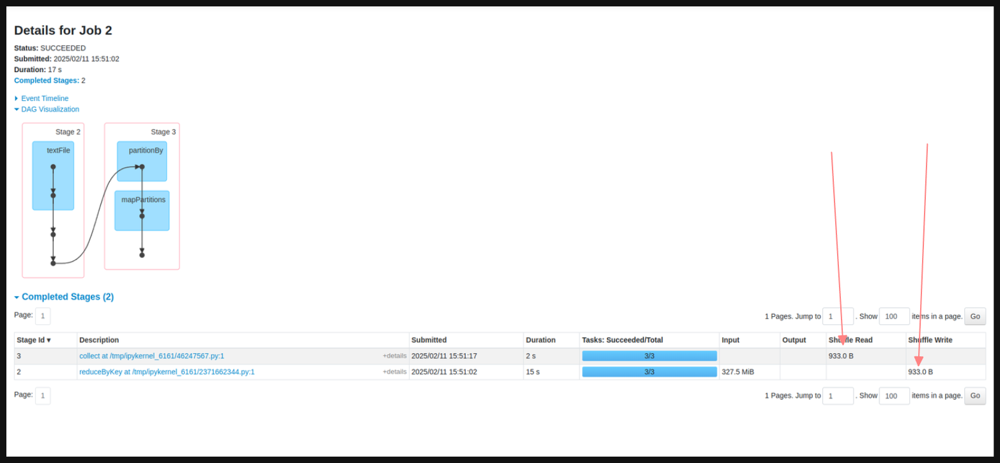
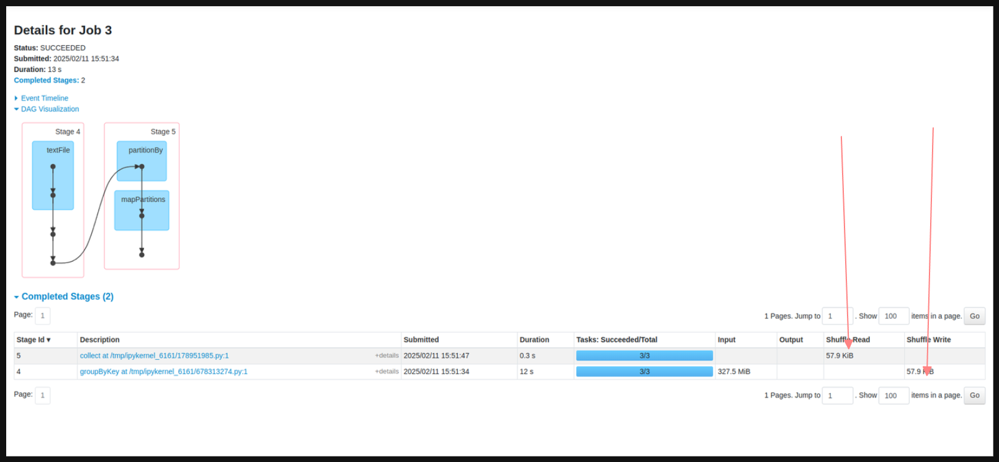

### **RDD Execution Steps**

1. **Data Loading** – Read data from HDFS, S3, or databases.
2. **Partitioning** – Data is split into **smaller chunks (partitions).**
3. **Execution** – Spark processes each partition **in parallel**.

### **RDD Properties**

| Property             | Description                                       |
| -------------------- | ------------------------------------------------- |
| **Immutable**        | Cannot be modified after creation.                |
| **Partitioned**      | Distributed across nodes for parallel processing. |
| **Fault-Tolerant**   | Can recover data from lineage.                    |
| **Lazily Evaluated** | Execution is delayed until an action is called.   |

--- 

## **1. Lazy Evaluation in Spark**

### **Why Lazy Evaluation?**

- Optimizes execution by **building a DAG (Directed Acyclic Graph).**
- **Only executes transformations when an action is triggered**.

### **Transformations (Lazy) vs Actions (Triggers Execution)**

| Operation Type      | Description                  | Examples                           |
| ------------------- | ---------------------------- | ---------------------------------- |
| **Transformations** | Creates a new RDD            | `map()`, `filter()`, `flatMap()`   |
| **Actions**         | Executes all transformations | `collect()`, `count()`, `reduce()` |

---

## **2. Transformations & Actions in RDD**

### **Narrow Transformations (No Shuffling)**

- Each output partition **depends on a single input partition**.
- **Faster execution.**
- **Examples:** `map()`, `filter()`, `flatMap()`.

### **Wide Transformations (Shuffling Required)**

- Data is **redistributed across partitions**.
- **Slower due to network communication.**
- **Examples:** `reduceByKey()`, `groupByKey()`, `sortByKey()`.

#### **Example**

#### **ReduceByKey vs GroupByKey in Spark**

#### **1. ReduceByKey**

- **Type:** Wide Transformation
- **Definition:**
    - Aggregates values for each key using a **specified associative and commutative reduce function**.
    - **Combiner Optimization:** Combines the values **locally within each partition** before shuffling data across the network.
    - **Result:** Produces a single output value per key.
- **Example Function:**
    - `lambda x, y: x + y`
- **Key Points:**
    - Reduces the amount of data shuffled over the network.
    - More efficient for large datasets.
- **Output:**
    - RDD of `(key, aggregated_value)` pairs.
- **Example:**  
    Input: `[(a, 1), (b, 2), (a, 3), (b, 4)]`  
    Output: `[(a, 4), (b, 6)]`

#### **2. GroupByKey**

- **Type:** Wide Transformation
- **Definition:**
    - Groups all values associated with each key into a **single iterable collection**.
    - **No Aggregation:** Only groups data, does not perform aggregation.
- **Key Points:**
    - Shuffles all data across the network, which can be expensive for large datasets.
    - Suitable when aggregation is not required and all values per key are needed.
- **Output:**
    - RDD of `(key, Iterable[values])` pairs.
- **Example:**  
    Input: `[(a, 1), (b, 2), (a, 3), (b, 4)]`  
    Output: `[(a, [1, 3]), (b, [2, 4])]`

### **Differences Between ReduceByKey and GroupByKey**

| Feature            | ReduceByKey                               | GroupByKey                                 |
| ------------------ | ----------------------------------------- | ------------------------------------------ |
| **Operation Type** | Aggregates values per key.                | Groups values into an iterable per key.    |
| **Shuffling**      | Combines values locally before shuffling. | Shuffles all data directly.                |
| **Efficiency**     | More efficient for large datasets.        | Less efficient due to higher shuffle cost. |
| **Use Case**       | When aggregation is needed.               | When all values for a key are required.    |
| **Output**         | `(key, aggregated_value)` pairs.          | `(key, Iterable[values])` pairs.           |
#### **Shuffle in Wide Transformations**

- **Shuffle** involves **redistributing data** across the cluster.
- It is triggered when:
	-  Data needs to be grouped or aggregated across partitions.
- Shuffling is **resource-intensive** and **time-consuming**, as it involves:
	- Writing intermediate data to disk.
    - Network communication between nodes.

#### **Optimization Tip**

- Try to minimize **wide transformations** (e.g., shuffles) to improve performance.
- Use **narrow transformations** whenever possible to avoid the overhead of data shuffling.

---
