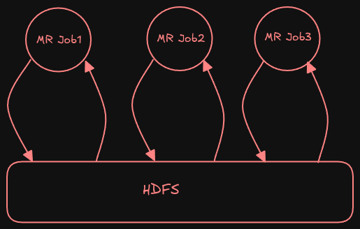
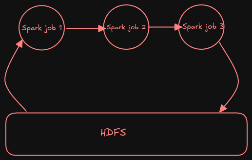
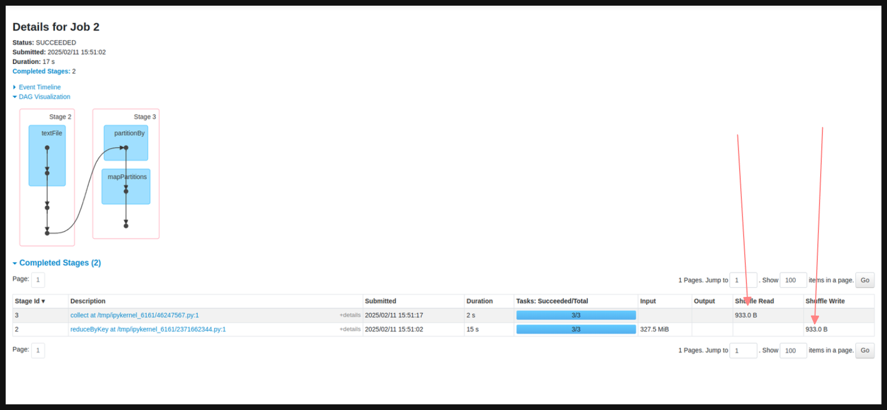

## Big Data Storage and Processing: Hadoop vs Spark

#### Storage: HDFS (Hadoop Distributed File System)
- HDFS is a **distributed storage system** designed to store large datasets across multiple machines

##### Resource Management: YARN
- **Yet another Resource Negotiator (YARN** manages cluster resource.
- Alternate: **Docker** and **Kubernates** for containerised resource management.

##### MapReduce (MR)
- **MapReduce** is a traditional Big Data processing framework.
- It consist of two phase:
	- **Map Phase**: Processes and partitions the data.
	- **Reduce Phase**: Aggregates and summerizes the data.

--- 

### Pre-requisites Before Learning Hadoop & Spark

1. **Python** - Recommended programming language for working with Big Data.
2. **SQL** - Essential for querying large datasets.
3. **Hadoop Essentials** - Understanding **distributed storage (HDFS) and processing frameworks (MapReduce, YARN)**

---

### **Limitations of MapReduce**

1. **High Latency**: 
	- MapReduce heavily relies on **disk-based storage**, which slows down processing.
	- Intermediate data is written to disk between Map and Reduce phases, causing **high I/O operations**
	- This increases **latency**, making it inefficient for real-time application.
2. **Complexity and Boilerplate code**:
	 - Writing MapReduce jobs requires boilerplate code.
	 - Developers need to write separate **Mapper** and **Reducer** classes, making it harder to maintain.
3. **Only Batch Processing is Supported**:
	 - MapReduce is designed for **batch processing** and is **not suitable for real-time or interactive processing**.
	 - It cannot handle **streaming data**, making it inefficient for use cases like **real-time analytics or fraud detection**.
4. **Rigid Execution Flow**:
	 - MapReduce follows a **strict two-phase structure (Map -> Reduce)**.
	 - **No steps can be skipped,** and **custom processing flows are difficult to implement**
	 - **Chaining multiple MapReduce jobs** for complex workflows increases development effort and execution time.
5. **No Interactive Mode and Limited Job Monitoring:**
	- MapReduce lacks an **interactive execution mode,** meaning jobs must be fully executed before seeing results.
	- **Monitoring running jobs in real-time is limited,** making debugging and optimisation difficult. 
		``` mermaid
		graph TD
			A[Input] --> B[Jar]
			B[Jar] --> C[Output]
		```
#####  **How Apache Spark Overcomes These Limitations**

Due to the **limitations of MapReduce**, **Apache Spark** was developed as a **better and more efficient** data processing framework.

### **Apache Spark Overview**

- **Open-source distributed computing system** designed to process **large datasets quickly**.
- Built for **high performance**, **ease of use**, and **flexibility** in data processing.
- Supports multiple processing modes:
    - **Batch Processing** (like MapReduce but much faster)
    - **Real-time Streaming** (e.g., Spark Streaming)
    - **SQL Queries** (Spark SQL)
    - **Machine Learning** (MLlib)
    - **Graph Processing** (GraphX)

--- 

### **Characteristics of Apache Spark**

#### **1. In-Memory Processing**

- Spark processes data **in-memory**, making it **faster than traditional disk-based** processing.
- Unlike **MapReduce**, which writes intermediate data to **HDFS (disk)**, Spark minimises **disk I/O**, leading to **better performance**.
			MR Process

			 Spark Process

#### **2. Ease of Use**

- Spark supports **multiple programming languages**, making it more user-friendly.
- **Supported Languages:**
    - **Java, Python, Scala, R**
- **Rich Ecosystem & Libraries:**
    - **Spark SQL** – SQL queries on structured data
    - **Spark Streaming** – Real-time stream processing
    - **MLlib** – Machine learning
    - **GraphX** – Graph processing

#### **3. Unified Framework**

- Spark provides a **single framework** for handling **batch processing, real-time streaming, machine learning, and graph processing**.

#### **4. Storage Flexibility**

- Spark can work with various **storage systems**, including:
    - **HDFS (Hadoop Distributed File System)**
    - **Amazon S3**
    - **NoSQL databases** (Cassandra, HBase)
    - **Relational databases (SQL-based systems)**

---

### **Key Features of Apache Spark**

1. **Speed**
    
    - **In-memory processing** reduces disk I/O, making Spark **up to 100x faster** than MapReduce.

2. **Scalability**
    
    - Spark can scale **horizontally** to **thousands of nodes** in a cluster.

3. **Fault Tolerance & Automatic Recovery**

	- Spark **automatically recovers data** in case of failure using **RDD lineage and DAG execution**.
	- If a node fails, Spark **recomputes lost data** from previous transformations instead of reprocessing everything.

 4. **Multi-Language (Polyglot) Support**

	- Spark supports multiple programming languages, including:
	    - **Scala** (native language)
	    - **Python (PySpark)**
	    - **Java**
	    - **R**

 5. **Unified Framework**

	- Spark provides a **single framework** for:
	    - **Batch Processing** (like MapReduce)
	    - **Real-time Streaming** (Spark Streaming)
	    - **Machine Learning** (MLlib)
	    - **Graph Processing** (GraphX)

 6. **Integration with Existing Systems**

	- Spark works **seamlessly** with various storage and streaming platforms:
	    - **Storage:**
	        - Hadoop HDFS
	        - Amazon S3
	        - NoSQL databases (Cassandra, HBase, MongoDB)
	    - **Streaming Platforms:**
	        - Apache Kafka
	        - Flink
	        - Other real-time data sources

### **RDD and Execution Plan in Apache Spark**

#### **What is an RDD (Resilient Distributed Dataset)?**

- **RDD** is a fundamental data structure in Spark that represents a distributed collection of data.
- Data in an RDD is divided into **partitions**. Each partition corresponds to a **block** on disk or memory.

---

#### **Execution Flow of RDD**

1. **Data Loading:**
    
    - Data is loaded from **disk to memory** in the form of **blocks** (e.g., HDFS blocks).
    - Each block corresponds to a **partition** in memory.
    - Example: If the block size is **300MB** and the HDFS block size is **128MB**, it is divided into **3 blocks**.
2. **Partition Mapping:**
    
    - Each **partition** in memory maps to **1 block** on the disk.

---

#### **Steps in Execution:**

1. Data is **read from HDFS** or other storage systems.
2. It is **partitioned** and **processed in Spark**.
3. After processing, results are either **stored back to the disk** or returned.

---

#### **Lazy Evaluation in Spark**

**Spark Operations:**

- Spark operations are categorized into two types:
    1. **Transformations:**
        
        - Create a **new RDD** from an existing one.
        - Examples: `map()`, `filter()`, `flatMap()`
        - These are **lazy** and not executed immediately.
    2. **Actions:**
        
        - Trigger the **execution** of all transformations to produce a result.
        - Examples: `collect()`, `count()`, `take()`, `reduce()`

**Why Lazy Evaluation?**

- To **optimize performance** and **reduce unnecessary computations**.
- Instead of executing operations immediately, Spark:
    - Builds a **Directed Acyclic Graph (DAG)** of transformations.
    - Executes computations **only when an action** (e.g., `collect()` or `count()`) is called.

---
### **Apache Spark RDD: Transformations, Actions, and Properties**

#### **What is an RDD?**

- **RDD (Resilient Distributed Dataset):**
    - A fault-tolerant, distributed collection of data elements.
    - It is the **fundamental data structure** in Spark.
    - RDDs are **immutable** and can be rebuilt in case of failure using **lineage information**.

---

### **Properties/Characteristics of RDD**

1. **Immutable:**
    
    - Once created, the data in an RDD cannot be modified.
    - New RDDs can be created by applying transformations on existing ones.
2. **Partitioned:**
    
    - Data in an RDD is divided into **partitions** across the cluster for distributed processing.
3. **Fault Tolerant:**
    
    - RDDs are resilient and can quickly **recover lost data** using lineage information.
4. **Lazily Evaluated:**
    
    - Transformations are not executed immediately but are delayed until an **action** is called.
5. **Resilient:**
    
    - RDDs are designed to recover from failures without data loss.

---

### **Transformations**

Transformations create **new RDDs** from existing ones. They are **lazy operations**.

Common Transformations:

- **map()**: Applies a function to each element in the RDD.
- **flatMap()**: Similar to `map()` but can return multiple values for each input element.
- **filter()**: Filters elements based on a condition.
- **union()**: Combines two RDDs.
- **distinct()**: Removes duplicate elements.
- **repartition()**: Re-distributes the data into more or fewer partitions.
- **coalesce()**: Reduces the number of partitions.
- **groupByKey()**: Groups values for each key.
- **reduceByKey()**: Combines values for each key

---
### **Reading and Processing Data in Spark**

#### **How Data is Read and Divided in Spark**

- In Spark, data is read and divided into **partitions** for distributed processing.
- **Partitioning** helps distribute large datasets into smaller chunks to allow parallel processing.

---

#### **What is Partitioning in Spark?**

- **Partitions** are **logical chunks of data**.
- Large datasets are divided into **smaller chunks**, called **partitions**.
- Spark processes data in **parallel** by assigning one **task per partition**.

---

#### **Sources for Reading Data**

1. **Pre-partitioned Data (e.g., HDFS, S3, ADLS Gen 2):**
    
    - Data is already divided into blocks (e.g., HDFS blocks), which are mapped directly to partitions.
2. **Custom Partitioning:**
    
    - Data is read and partitioned based on **configuration settings**.

---

#### **Task Execution**

- **Execution of a Partition:**
    
    - Each partition is processed as **one task**.
    - **1 CPU core** is required for executing one task.
- Example:
    
    - If there are **8 blocks**, Spark creates:
        - **8 partitions**
        - **8 tasks**

---

#### **Parallelism in Spark**

- More partitions enable **better parallelism**, as multiple tasks can run concurrently.

#### **Spark `parallelize()` Method**

- Used to create an RDD from an existing collection (e.g., list, array).
- **Default number of partitions** when using `parallelize()` is **2**.
- The data is distributed across multiple partitions, allowing parallel processing in the cluster.

---

### **Understanding Partitions, Blocks, and Transformations in Apache Spark**

#### **Data Partitioning Examples**

- **1GB Data** → Divided into **8 blocks** → **8 partitions**
- **512MB Data** → Divided into **4 blocks** → **4 partitions**
- **100MB Data** → Divided into **1 block** → **1 partition**

---

### **Transformations in Apache Spark**

- Transformations create a **new RDD** from an existing one.
- They are **lazy** and are executed only when an **action** is triggered.

#### **Types of Transformations**

1. **Narrow Transformations**
    
    - No data shuffling occurs across partitions.
    - Dependencies are **one-to-one** (each output partition depends on a single input partition).
    - **Examples:**
        - `map()`
        - `filter()`
        - `flatMap()`
2. **Wide Transformations**
    
    - Data is **shuffled across partitions**.
    - Dependencies are **one-to-many** (each output partition depends on multiple input partitions).
    - **Examples:**
        - `reduceByKey()`
        - `groupByKey()`
        - `sortByKey()`
        - `flatMap()` with data shuffling.

---

### **Shuffle in Wide Transformations**

- **Shuffle** involves **redistributing data** across the cluster.
- It is triggered when:
    - Data needs to be grouped or aggregated across partitions.
- Shuffling is **resource-intensive** and **time-consuming**, as it involves:
    - Writing intermediate data to disk.
    - Network communication between nodes.

---

#### **Optimization Tip**

- Try to minimize **wide transformations** (e.g., shuffles) to improve performance.
- Use **narrow transformations** whenever possible to avoid the overhead of data shuffling.

---
### **ReduceByKey vs GroupByKey in Spark**

#### **1. ReduceByKey**

- **Type:** Wide Transformation
- **Definition:**
    - Aggregates values for each key using a **specified associative and commutative reduce function**.
    - **Combiner Optimization:** Combines the values **locally within each partition** before shuffling data across the network.
    - **Result:** Produces a single output value per key.
- **Example Function:**
    - `lambda x, y: x + y`
- **Key Points:**
    - Reduces the amount of data shuffled over the network.
    - More efficient for large datasets.
- **Output:**
    - RDD of `(key, aggregated_value)` pairs.
- **Example:**  
    Input: `[(a, 1), (b, 2), (a, 3), (b, 4)]`  
    Output: `[(a, 4), (b, 6)]`



---

#### **2. GroupByKey**

- **Type:** Wide Transformation
- **Definition:**
    - Groups all values associated with each key into a **single iterable collection**.
    - **No Aggregation:** Only groups data, does not perform aggregation.
- **Key Points:**
    - Shuffles all data across the network, which can be expensive for large datasets.
    - Suitable when aggregation is not required and all values per key are needed.
- **Output:**
    - RDD of `(key, Iterable[values])` pairs.
- **Example:**  
    Input: `[(a, 1), (b, 2), (a, 3), (b, 4)]`  
    Output: `[(a, [1, 3]), (b, [2, 4])]`


---

### **Differences Between ReduceByKey and GroupByKey**

|Feature|ReduceByKey|GroupByKey|
|---|---|---|
|**Operation Type**|Aggregates values per key.|Groups values into an iterable per key.|
|**Shuffling**|Combines values locally before shuffling.|Shuffles all data directly.|
|**Efficiency**|More efficient for large datasets.|Less efficient due to higher shuffle cost.|
|**Use Case**|When aggregation is needed.|When all values for a key are required.|
|**Output**|`(key, aggregated_value)` pairs.|`(key, Iterable[values])` pairs.|

---

#### **Recommendation**

- Use **ReduceByKey** for **aggregation tasks** to minimize shuffle and optimize performance.
- Use **GroupByKey** only when you need all values associated with each key.

---
### **Higher-Level APIs in Apache Spark**

#### **Why RDDs are Not Used Primarily?**

Although RDDs (Resilient Distributed Datasets) were the initial abstraction in Spark, they have some limitations:

1. **Verbosity:** Requires writing more code compared to higher-level APIs.
2. **Error-Prone:** More chances for human error due to complex code.
3. **Performance:** Limited optimization capabilities.
4. **No Built-in Schema Support:** Lacks schema and metadata for data processing.
5. **Inefficient Query Optimization:** Does not support query optimization like SQL-based APIs.

---

#### **What are Higher-Level APIs in Spark?**

- Higher-level APIs include **DataFrame** and **SparkSQL**.
- These APIs provide schema-aware processing and are easier to use compared to RDDs.

---

#### **Advantages of Higher-Level APIs**

6. **Schema Awareness:**
    - They provide schema support, enabling better query optimization.
7. **Performance Optimisation:**
    - Spark uses **Catalyst Optimizer** and **Tungsten Execution Engine** for efficient execution.
8. **Ease of Use:**
    - SQL-like programming for querying data.
9. **Integration with Data Sources:**
    - Seamless integration with various data sources like JSON, Parquet, CSV, Avro, etc.
10. **Declarative Programming:**
    - Simplifies data manipulation using SQL queries or high-level transformations.

---

#### **DataFrame**

- A **distributed collection of data** organized into named columns.
- Similar to a **table** in a relational database or a **data frame** in Python's pandas or R.
- Supports SQL-like operations and is optimized for large-scale data processing.

## **Spark DataFrame Reading Process**

### **Steps in `spark.read`**

11. **Format** → Specifies the file format (e.g., CSV, JSON, Parquet).
12. **Header** → Determines whether the first row should be treated as column names.
13. **Infer Schema** → Automatically detects column data types (**Avoid This**).
14. **Load** → Reads data from a specified source (e.g., HDFS, S3, local storage).

### **Best Practice: Avoid `inferSchema`**

- **Why?** Inferring schema triggers **extra jobs** to scan data, leading to performance overhead.
- **Solution:** **Manually define the schema** to improve efficiency and reduce computation time.

## **Spark Read: Action or Transformation?**

### **Behaviour of `spark.read` in Different Scenarios**

When reading data in Spark, the behaviour of `spark.read` depends on how the schema is handled.

### **1. Without `inferSchema`, with `header=True`**

- **Behaviour:** Eager Evaluation
- **Explanation:**
    - Reads only the first line of the file to determine column names.
    - Triggers a lightweight job using `collect` with `limit 1`.

### **2. With `inferSchema=True`**

- **Behaviour:** Eager Evaluation
- **Explanation:**
    - Scans the entire dataset to infer the schema.
    - Triggers **two jobs**:
        - One job to read column names.
        - Another job to infer data types for each column.

### **3. With Explicit Schema Definition**

- **Behaviour:** Lazy Evaluation
- **Explanation:**
    - No upfront job is triggered.
    - Schema validation occurs **only when an action is performed** on the DataFrame.

### **Key Takeaways:**

- **Eager Evaluation:** Schema inference (`inferSchema=True`) triggers jobs immediately.
- **Lazy Evaluation:** Defining the schema explicitly avoids upfront computation.
- **Performance Tip:** For large datasets, explicitly defining the schema improves performance by preventing unnecessary scans.

#### **SparkSQL**

- Allows querying structured data using SQL.
- Provides integration between SQL and Python/Scala/Java APIs.

## **Schema Enforcement in Spark DataFrame**

### **Challenges with `inferSchema`**

Using `inferSchema=True` can cause several issues:

15. **Incorrect Inference** → Spark might incorrectly detect column data types.
16. **Performance Issues** → Inferring schema requires scanning the dataset, adding overhead.
17. **Bad for Production** → Unreliable schema detection can lead to inconsistencies in data processing.

### **Issues with Headers & Schema Inference**

- Headers are mapped to column names (`c1`, `c2`, etc.).
- Schema inference may produce **incorrect or inconsistent** results.

---

## **Schema Enforcement Techniques**

To avoid the drawbacks of `inferSchema`, enforce schema using the following methods:

### **1. `StructType` (Recommended)**

- **Why?**
    - Avoids incorrect type inference.
    - Ensures a consistent schema across datasets.
    - Enables **stricter validation**, preventing unexpected `NULL` values.

### **2. DDL String**

- Schema can also be defined using a **Data Definition Language (DDL) string** for flexibility.